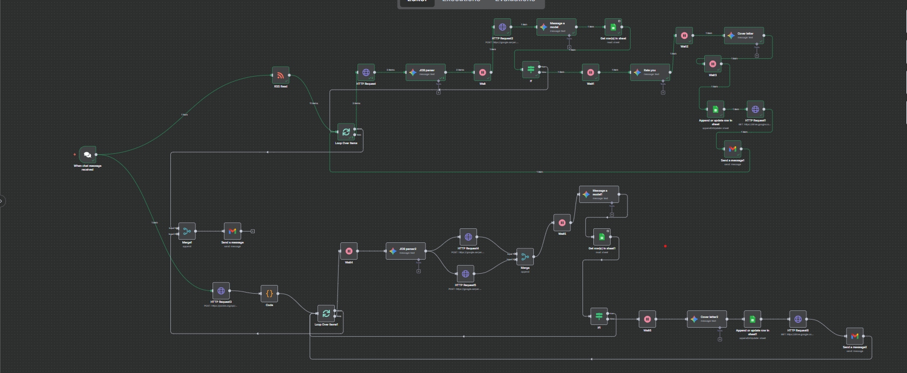

# Job Application Automation Agent (n8n)

This is an **automation agent** made with **n8n** that applies for jobs automatically.  
It can pull jobs from **LinkedIn** and **Jooble**, read the job description, write a custom cover letter, find HR emails, check if the email is real, and then send the application with your resume.  
All jobs you apply for are saved in a Google Sheet.

---

## 📊 Workflow Diagram


## 📌 What This Agent Does

The agent has two flows:

### 🔹 LinkedIn Jobs Flow
- Uses an **RSS feed** made with [rss.app](https://rss.app).  
- Collects jobs from a LinkedIn job search page.  
- Runs the job through:
  1. Parse details with Gemini AI  
  2. Rate the job fit  
  3. Write a cover letter  
  4. Find HR email  
  5. Verify email with MailboxLayer  
  6. Send application with Gmail  
  7. Save to Google Sheets  

### 🔹 Jooble Jobs Flow
- Uses the **Jooble API** to fetch jobs.  
- You can set your own keywords and location inside the **HTTP Request3 node**.  
- Runs the same process as above: parse → rate → cover letter → HR email → verify → send → save.  

---

## ⚙️ Tools Used

- **n8n** → workflow automation  
- **Google Gemini AI** → parsing jobs, writing cover letters, rating jobs, extracting emails  
- **Gmail** → sending applications  
- **Google Sheets** → saving logs of applied jobs  
- **MailboxLayer** → verifying HR emails  
- **rss.app** → making RSS feeds from LinkedIn job search pages  
- **Jooble API** → pulling jobs directly  
- **Serper API** → searching for HR emails  

---

## 📝 Setup Guide

### 1. Import Workflow
- Import the file `Job Applying Automated.json` into your n8n instance.  

### 2. Setup LinkedIn Jobs Flow
- Go to LinkedIn and search for jobs you want.  
- Copy the job search page link.  
- Paste it into [rss.app](https://rss.app) to make an RSS link.  
- Put that link into the **RSS Read node**.  

### 3. Setup Jooble Jobs Flow
- Open the **HTTP Request3 node**.  
- Change the JSON body to your own keywords and location, for example:  
  ```json
  {
    "keywords": "Data Scientist",
    "location": "Remote"
  }
  ```
- Jooble will return jobs based on your filters.

### 4. Connect Google Gemini
- Go to Google AI Studio and get an API key.
- In n8n, add this as Google PaLM / Gemini credentials.
- Assign this to all Gemini nodes (JOB parser, Cover letter, Rate you, Message a model, etc.).
- Keep the Wait nodes (10–20 sec) to avoid free API limits.

### 5. Connect Gmail
- In n8n, add Gmail OAuth2 credentials.
- Allow the send email scope.
- Use this in Send a message1 and Send a message2 nodes.

### 6. Setup Google Sheet
- Create a new Google Sheet.
- Add headers in the first row:
  ```
  Title | Job Description | Link | Date | Rating | Company Name | Benefits | Cover Letter | Email
  ```
- Share the sheet with the Google account connected in n8n.
- Paste the Sheet ID into the Google Sheets nodes.

### 7. Setup MailboxLayer
- Create a free account on MailboxLayer.
- Copy your API key.
- Replace the sample key in the HTTP Request7 and HTTP Request8 nodes.
- The workflow only continues if:
  - `mx_found = true` (domain accepts emails)
  - `smtp_check = true` (mailbox exists)
  - `disposable = false` (not a temp email)

### 8. Upload Resume
- Upload your resume to Google Drive.
- Copy the file ID from the share link.
- Put it into HTTP Request1 and HTTP Request6 nodes like this:
  ```
  https://drive.google.com/uc?export=download&id=FILE_ID
  ```

### 9. Wait Nodes
- Already included to slow down execution.
- This avoids hitting free limits for Gemini or Gmail.
- You can increase or decrease the seconds as you like.

---

## ✅ Flow Example

1. Jobs are fetched from LinkedIn RSS or Jooble API.
2. Gemini AI reads the job and extracts company info.
3. Gemini rates if the job matches your skills.
4. Gemini writes a personalized cover letter.
5. HR email is found with Serper + Linkedin.
6. MailboxLayer checks if the email is valid.
7. Gmail sends the application (cover letter + resume).
8. Google Sheet is updated with all details.

---

## 🎯 Why Use This Agent

- Looks for jobs on two platforms (LinkedIn + Jooble).
- Applies for the job via email to HR of the company.
- Saves you hours of manual work.
- Creates personalized cover letters instantly.
- Sends only to real HR emails.
- Keeps a clean log of all applications.
- Easy to change keywords, locations, or job sources.
